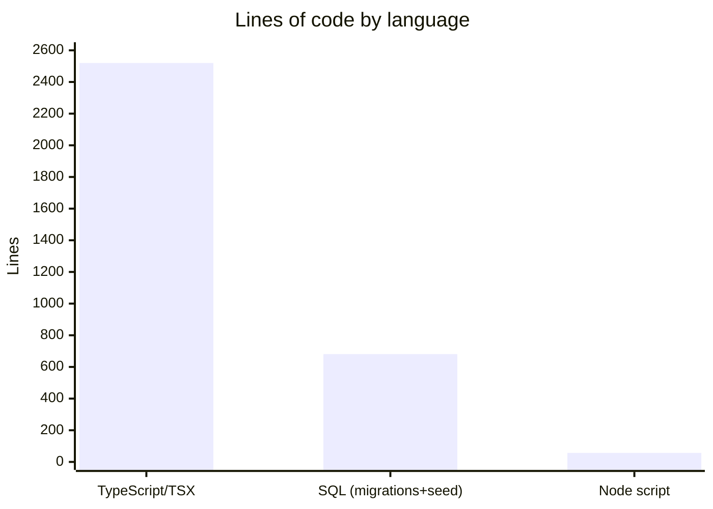

# By the numbers

A quantitative snapshot of the Flack codebase.

> Data collected on 2026-06-12 from the `main` branch at commit `e77b794`.

## Size

The tracked source (under `src/`, `e2e/`, `supabase/`, `scripts/`) totals roughly 3,200 lines across TypeScript/TSX, SQL, and a Node script.

- **TypeScript/TSX source files:** 30 under `src/` (24 implementation + 6 colocated tests/specs counting e2e)
- **Test/spec files:** 6 — `src/lib/utils.test.ts`, `src/lib/health.test.ts`, `src/lib/logger.test.ts`, `src/features/messages/optimistic.test.ts`, `e2e/auth-routing.spec.ts`, `e2e/health.spec.ts`
- **SQL migrations:** 2 (`001_initial_schema.sql`, `002_multi_tenant_organizations.sql`) plus `seed.sql`

## Largest files

| File                                                     | Lines |
| -------------------------------------------------------- | ----- |
| `src/features/chat/chat-workspace.tsx`                   | 657   |
| `src/features/chat/chat-parts.tsx`                       | 464   |
| `supabase/migrations/001_initial_schema.sql`             | 397   |
| `supabase/migrations/002_multi_tenant_organizations.sql` | 283   |
| `src/features/auth/login-form.tsx`                       | 220   |
| `src/features/auth/signup-form.tsx`                      | 153   |
| `src/types/database.ts`                                  | 123   |

ESLint enforces `max-lines: 600` (blank/comment lines excluded) on `.ts`/`.tsx`, which is why the chat UI was split into a container (`chat-workspace.tsx`) and presentational parts (`chat-parts.tsx`). See [Patterns and conventions](how-to-contribute/patterns-and-conventions.md).

## Activity

The repository has a single commit, `e77b794` ("Initial Flack app"), authored on 2026-06-11. The working tree carries follow-up tooling and observability changes (logging, health checks, CODEOWNERS, lint rules, tests) that are not yet committed. There is no multi-week history to trend yet, so churn hotspots are not meaningful at this stage.

## Bot-attributed commits

0% of commits currently carry bot co-authorship. The single commit is human-authored. (This counts only `Co-authored-by` trailers; inline AI assistance leaves no git trace, so this is a lower bound.)

## Complexity and quality gates

- **Cyclomatic complexity ceiling:** 20 per function (ESLint `complexity` rule)
- **Duplicate code threshold:** 3% (`jscpd`, `.jscpd.json`)
- **Technical-debt markers:** 0 (`scan-tech-debt.mjs` reports none)
- **Unit-test coverage (logic layer):** 100% statements/functions/lines, 90%+ branches, enforced on `src/lib/utils.ts` and `src/features/messages/optimistic.ts` (`vitest.config.ts`)

For where these gates run, see [Tooling](how-to-contribute/tooling.md) and [Dependencies](reference/dependencies.md).
