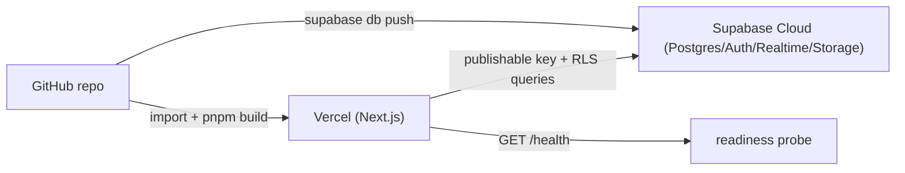

# Deployment

Flack deploys as a Vercel frontend backed by Supabase Cloud. There is no separate server to operate; the database (with its RLS, functions, and triggers) is the backend.

## Topology



## Supabase Cloud

1. Create a project at supabase.com.
2. Link and push migrations:
   ```bash
   supabase link --project-ref <your-project-ref>
   supabase db push
   ```
   This applies the migrations in `supabase/migrations/` to the cloud database. Never edit an applied migration — add a new one (see the [supabase-migration skill](how-to-contribute/tooling.md)).
3. In Supabase Auth settings, add the deployed URL and `<site-url>/auth/callback` to the allowed redirect URLs, mirroring the local `additional_redirect_urls` in `supabase/config.toml`.

## Vercel

1. Import the repository (Vercel auto-detects Next.js and builds with `pnpm build`).
2. Set environment variables for Production and Preview:
   - `NEXT_PUBLIC_SUPABASE_URL` → your Supabase Cloud API URL
   - `NEXT_PUBLIC_SUPABASE_PUBLISHABLE_KEY` → your publishable key
   - `NEXT_PUBLIC_SITE_URL` → the deployed URL
   - `LOG_LEVEL` → optional; `info` is the production default
3. Deploy.

Only public `NEXT_PUBLIC_*` keys are set; never put a service-role key in Vercel env or client code. See [Configuration](reference/configuration.md) and [Security](security.md).

## Post-deploy verification

Hit `GET /health` on the deployed URL. A `200` with `status: "ok"` confirms the app can reach Supabase Auth; a `503`/`degraded` indicates missing env or an unreachable backend. The endpoint is `no-store` cached and safe to wire into an uptime monitor. See [How to monitor](how-to-monitor.md).

## CI relationship

The `Code Quality` workflow (`.github/workflows/code-quality.yml`) gates merges with lint, typecheck, tests, knip, jscpd, and the tech-debt scan, but it does not deploy. Deployment is driven by Vercel's Git integration (build on push/PR) and the manual `supabase db push` for schema changes.
