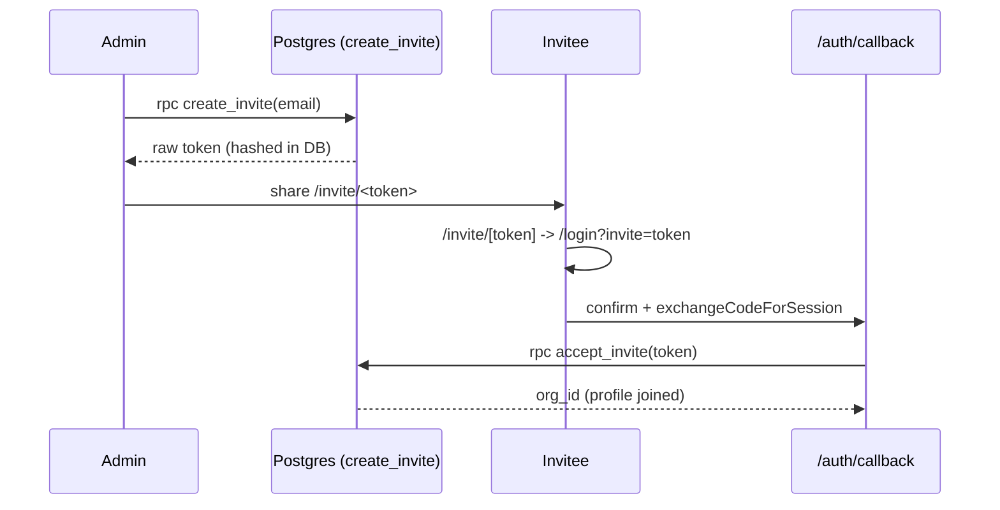

# Authentication

Active contributors: factory-sam

## Purpose

Flack uses Supabase Auth for email/password and magic-link sign-in, with cookie-based sessions managed by `@supabase/ssr`. Onboarding has two paths: creating a brand-new organization (you become admin) or accepting an email invite into an existing one. Most of the onboarding logic lives in the database, not the client.

## Directory layout

```
src/app/
  (auth)/login/page.tsx          # renders LoginForm
  (auth)/signup/page.tsx         # renders SignupForm
  (auth)/invite/[token]/page.tsx # server: accept invite or bounce to login
  (app)/layout.tsx               # auth guard for the chat surface
  auth/callback/route.ts         # code exchange + invite acceptance
src/features/auth/
  login-form.tsx                 # password / magic-link / invite-accept modes
  signup-form.tsx                # create-organization flow
src/middleware.ts                # session refresh on every request
```

## Key abstractions

| Symbol            | File                                     | Role                                                                 |
| ----------------- | ---------------------------------------- | -------------------------------------------------------------------- |
| `LoginForm`       | `src/features/auth/login-form.tsx`       | Three modes: `password`, `magic`, `accept` (invite signup)           |
| `SignupForm`      | `src/features/auth/signup-form.tsx`      | Creates an org via `organization_name` metadata                      |
| `AppLayout`       | `src/app/(app)/layout.tsx`               | Redirects to `/login` when `auth.getUser()` is empty                 |
| `InvitePage`      | `src/app/(auth)/invite/[token]/page.tsx` | Accepts invite if signed in, else redirects to `/login?invite=token` |
| `GET` (callback)  | `src/app/auth/callback/route.ts`         | `exchangeCodeForSession` + optional `accept_invite`                  |
| `handle_new_user` | `supabase/migrations/002_*.sql`          | Trigger that provisions profile/org/channels on signup               |

## How it works

### Creating an organization

`SignupForm` calls `supabase.auth.signUp` with `data: { onboarding_kind: "create_org", organization_name }`. When the auth user is created, the `handle_new_user` trigger reads `organization_name` from the user metadata, inserts a new `organizations` row, creates the admin `profiles` row, and provisions default `#general` and `#random` channels via `create_default_channels`. If email confirmation is required, the user finishes via `/auth/callback`.

### Signing in

`LoginForm` in `password` mode calls `signInWithPassword`; in `magic` mode it calls `signInWithOtp` with `emailRedirectTo` pointing at `/auth/callback`. On success it `router.refresh()` and pushes to `/`.

### Accepting an invite



`/invite/[token]/page.tsx` is a server component: if the visitor already has a session it calls `accept_invite` immediately and redirects home; otherwise it forwards to `/login?invite=token`, where `LoginForm` switches to its `accept` mode and carries the token through signup or sign-in. The token is matched against a SHA-256 `token_hash` and must be unexpired and email-matched. See [Security](../security.md).

## Integration points

- **Session refresh:** `src/middleware.ts` runs `updateSession` (in `src/lib/supabase/middleware.ts`) on nearly every request so server components see a fresh cookie. See [Supabase access layer](../systems/supabase-access-layer.md).
- **Guarding:** `(app)/layout.tsx` is the single gate for the authenticated surface; it redirects unauthenticated users to `/login`.
- **Downstream:** once authenticated, the [chat workspace](messaging.md) loads the user's profile and org members.
- **Logging:** the callback route logs failures through the structured logger (`scope: "auth.callback"`). See [Observability](../systems/observability.md).

## Entry points for modification

To change sign-in behavior or add a provider, start in `src/features/auth/login-form.tsx` and the `/auth/callback` route. To change what happens when a user is provisioned (default channels, role assignment), edit the `handle_new_user` trigger and `create_default_channels`/`accept_invite` functions via a new migration — see the [supabase-migration skill](../how-to-contribute/tooling.md).
