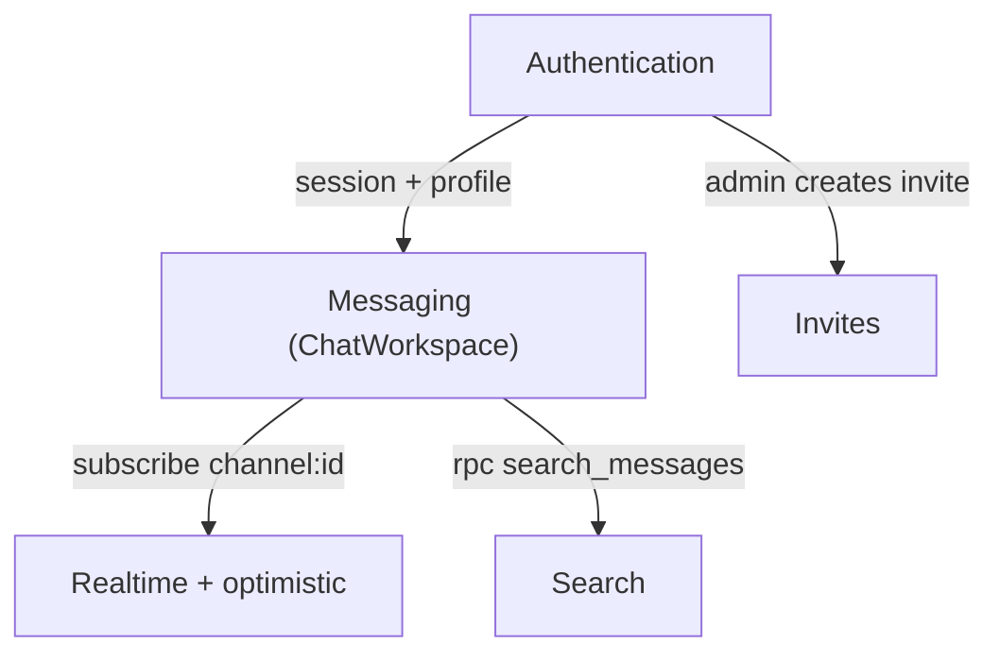

# Features

The user-facing capabilities of Flack, organized by what they do rather than where the files live. Each feature spans the React UI, the Supabase client layer, and SQL in the database.

## Feature map

| Feature                                                  | Entry point                                                               | Backed by                                                             |
| -------------------------------------------------------- | ------------------------------------------------------------------------- | --------------------------------------------------------------------- |
| [Authentication](authentication.md)                      | `src/features/auth/`, `src/app/(auth)/`, `src/app/auth/callback/route.ts` | Supabase Auth, `handle_new_user`, `accept_invite`                     |
| [Messaging](messaging.md)                                | `src/features/chat/chat-workspace.tsx`                                    | `channels`, `channel_members`, `messages`, `attachments`, `reactions` |
| [Realtime and optimistic UI](realtime-and-optimistic.md) | `src/features/messages/optimistic.ts`                                     | Realtime broadcast triggers                                           |
| [Search](search.md)                                      | search overlay in `chat-parts.tsx`                                        | `search_messages` Postgres function                                   |

## How features compose

A signed-in user lands in the [chat workspace](messaging.md), which loads their org's channels and members, opens a [realtime subscription](realtime-and-optimistic.md) for the active channel, and exposes [search](search.md) over a Cmd/Ctrl-K overlay. Admin users also get invite controls that call the `create_invite` RPC.

All of these are constrained by the database's row-level security, so the same UI shows only the data a given user is allowed to see. See [Security](../security.md) for the authorization rules and [Data models](../reference/data-models.md) for the underlying tables.
