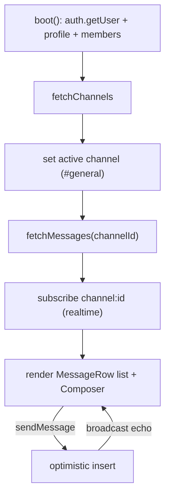

# Messaging

Active contributors: factory-sam

## Purpose

Messaging is the core of Flack: channels (public/private), direct messages, threaded replies, reactions, mentions, and file attachments, all rendered in a single dense workspace. The `ChatWorkspace` client component owns the state and orchestration; presentational pieces live in `chat-parts.tsx`.

## Directory layout

```
src/features/chat/
  chat-workspace.tsx   # container: state, data loading, realtime, writes (657 lines)
  chat-parts.tsx       # presentational subcomponents + small helpers (464 lines)
src/types/chat.ts      # Channel, ChatMessage, Profile, Reaction, Attachment, SearchHit
```

## Key abstractions

| Symbol                                                     | File                                   | Role                                                     |
| ---------------------------------------------------------- | -------------------------------------- | -------------------------------------------------------- |
| `ChatWorkspace`                                            | `src/features/chat/chat-workspace.tsx` | Top-level container; holds all chat state                |
| `fetchChannels` / `fetchMessages`                          | `src/features/chat/chat-workspace.tsx` | Load channels and messages for the active channel/thread |
| `sendMessage`                                              | `src/features/chat/chat-workspace.tsx` | Optimistic send + upload + insert                        |
| `createChannel` / `createDm` / `createInvite`              | `src/features/chat/chat-workspace.tsx` | Channel, DM, and invite creation                         |
| `toggleReaction`                                           | `src/features/chat/chat-workspace.tsx` | Add/remove a reaction                                    |
| `Composer`, `MessageRow`, `ChannelButton`, `SearchOverlay` | `src/features/chat/chat-parts.tsx`     | Presentational components                                |

## How it works

On mount, `ChatWorkspace` boots: it reads the authenticated user, loads the user's `profiles` row and org members, then fetches channels. The active channel defaults to `#general`. Selecting a channel triggers `fetchMessages`, which pulls up to 80 non-deleted root messages with their author profile, reactions, and attachments via a single nested Supabase select.



### Channels, DMs, and threads

- **Public channels** are visible to everyone in the org; **private channels** only to members (enforced by RLS). `createChannel` slugifies the name, inserts the channel, and adds the creator as `owner`.
- **DMs** are channels of `type = 'dm'` named by sorting and joining the two user ids with `:`. `createDm` inserts the channel plus both memberships.
- **Threads** open in the right rail. `openThread` loads replies where `parent_id` equals the root message id; the thread `Composer` sends with that `parentId`.

### Reactions, mentions, attachments

- Reactions are stored as short tokens (`+1`, `eyes`, `check`) and rendered by `displayEmoji`. `toggleReaction` inserts or deletes a row, then refetches.
- Attachments upload to the private `attachments` Storage bucket under `channelId/messageId/uuid-filename`, then an `attachments` row is inserted.
- Mentions and notifications are created by database triggers (`create_mention_notifications`).

### Presence and typing

The realtime channel also carries presence (online count) and a `typing` broadcast event; typing indicators expire after ~3.5s.

## Integration points

- **Auth:** requires a session and profile from [Authentication](authentication.md).
- **Realtime + optimistic state:** message list updates flow through the pure helpers in `src/features/messages/optimistic.ts`. See [Realtime and optimistic UI](realtime-and-optimistic.md).
- **Search:** the Cmd/Ctrl-K overlay calls `search_messages`. See [Search](search.md).
- **Database:** all reads/writes are RLS-gated. See [Data models](../reference/data-models.md) and [Security](../security.md).

## Entry points for modification

To change message rendering or the composer, edit `src/features/chat/chat-parts.tsx`. To change loading, sending, or realtime wiring, edit `src/features/chat/chat-workspace.tsx`. Keep the container under the 600-line ESLint ceiling by extracting presentational pieces into `chat-parts.tsx`. Any new persisted field needs a migration and a `src/types/database.ts` update (see [Tooling](../how-to-contribute/tooling.md)).
