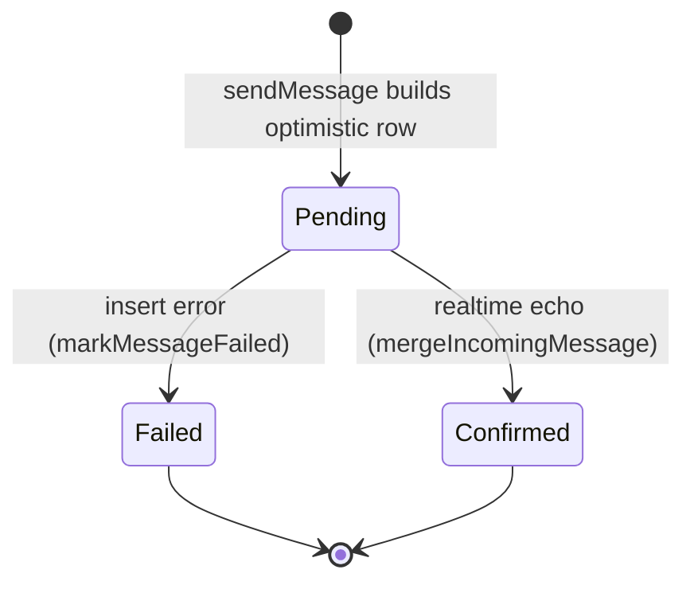
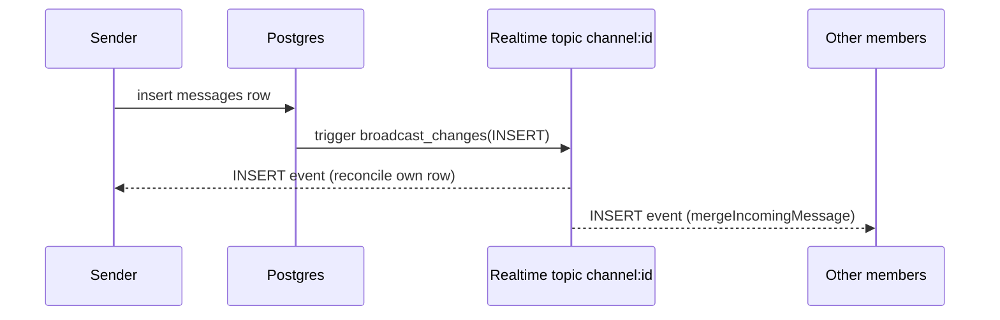

# Realtime and optimistic UI

Active contributors: factory-sam

## Purpose

Flack optimizes for perceived speed: a sent message appears instantly, before the server confirms it, and is then reconciled when the database broadcasts the committed row back to the client. This page covers the optimistic state machine and the Supabase Realtime wiring that drives it.

## Key abstractions

| Symbol                      | File                                         | Role                                                        |
| --------------------------- | -------------------------------------------- | ----------------------------------------------------------- |
| `mergeIncomingMessage`      | `src/features/messages/optimistic.ts`        | Insert-or-update a message by id, then sort by `created_at` |
| `markMessageFailed`         | `src/features/messages/optimistic.ts`        | Flip a message to `failed` when its insert errors           |
| `removeMessage`             | `src/features/messages/optimistic.ts`        | Drop a message (used by realtime DELETE)                    |
| `buildOptimisticMessage`    | `src/features/chat/chat-workspace.tsx`       | Construct the local `pending` row                           |
| `broadcast_message_changes` | `supabase/migrations/001_initial_schema.sql` | Trigger that pushes row changes to the topic                |

These helpers are pure functions over `ChatMessage[]`, which is why they are unit-tested to 100% coverage (`src/features/messages/optimistic.test.ts`). See [Testing](../how-to-contribute/testing.md).

## How optimistic sending works

`sendMessage` generates a UUID, builds an optimistic `ChatMessage` with `pending: true`, and merges it into local state immediately. It then uploads any attachment and inserts the `messages` row. If the insert throws, the row is flipped to `failed`; otherwise the database trigger broadcasts the committed row, and `mergeIncomingMessage` matches it by id and clears the `pending`/`failed` flags. Because the realtime subscription uses `broadcast: { self: true }`, the sender receives its own echo and reconciles rather than duplicating.

## How realtime delivery works

`ChatWorkspace` subscribes to a private channel `channel:<activeChannelId>` and registers handlers for `INSERT`, `UPDATE`, and `DELETE` broadcast events. INSERT/UPDATE merge the row; DELETE removes it via `removeMessage`. Reaction changes arrive on the same topic and trigger a refetch. The triggers that produce these events are `broadcast_message_changes` and `broadcast_reaction_changes` in the initial migration, and the topic itself is RLS-gated so only channel members can subscribe (see [Security](../security.md)).

## Integration points

- **Consumed by:** [Messaging](messaging.md) — `ChatWorkspace` calls these helpers from its realtime handlers and `sendMessage`.
- **Backed by:** the broadcast triggers in `supabase/migrations/001_initial_schema.sql`.
- **Types:** `ChatMessage` (with `pending`/`failed` flags) in `src/types/chat.ts`.

## Entry points for modification

To change reconciliation behavior (sorting, dedup, failure handling), edit `src/features/messages/optimistic.ts` and update its tests. To change which events the client reacts to, edit the realtime subscription block in `src/features/chat/chat-workspace.tsx`. If a new table needs to stream live, add a broadcast trigger in a migration following the [supabase-migration skill](../how-to-contribute/tooling.md).
