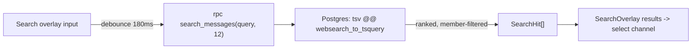

# Search

Active contributors: factory-sam

## Purpose

Flack provides full-text message search through a Cmd/Ctrl-K overlay. Ranking and filtering happen in Postgres via the `search_messages` function, so the client sends a query string and gets back ranked, membership-filtered hits.

## How it works

`ChatWorkspace` registers a global keydown handler that toggles the search overlay on Cmd/Ctrl-K. As the query changes (debounced ~180ms, minimum 2 characters), it calls the RPC:

```ts
const { data } = await supabase.rpc("search_messages", { query_text: searchQuery, limit_count: 12 });
```

The `search_messages` function (`supabase/migrations/001_initial_schema.sql`) is `security definer` and:

- filters to messages the caller can see with `public.is_channel_member(m.channel_id)`,
- excludes soft-deleted messages (`deleted_at is null`),
- matches against the generated `tsv` column using `websearch_to_tsquery('english', query_text)`,
- ranks with `ts_rank_cd` and caps results at `least(limit_count, 50)`.



Selecting a result switches the active channel and closes the overlay.

## Key abstractions

| Symbol                              | File                                         | Role                                          |
| ----------------------------------- | -------------------------------------------- | --------------------------------------------- |
| `SearchOverlay`                     | `src/features/chat/chat-parts.tsx`           | The Cmd/Ctrl-K result UI                      |
| `SearchHit`                         | `src/types/chat.ts`                          | Shape of a search result row                  |
| `search_messages`                   | `supabase/migrations/001_initial_schema.sql` | Ranking + membership-filtered query           |
| `messages.tsv` + `messages_tsv_idx` | `supabase/migrations/001_initial_schema.sql` | Generated `tsvector` column and its GIN index |

## Integration points

- **Triggered from:** the [chat workspace](messaging.md) keyboard handler.
- **Backed by:** the `tsv` generated column and GIN index on `messages`, defined in the initial migration.
- **Authorization:** results are filtered to channels the user belongs to, the same RLS posture as the rest of the app. See [Security](../security.md).

## Entry points for modification

To change the search UX (debounce, result count, rendering), edit the overlay logic in `src/features/chat/chat-workspace.tsx` and `SearchOverlay` in `chat-parts.tsx`. To change ranking or what fields are searchable, edit the `search_messages` function and the `tsv` definition in a new migration, then update the `search_messages` entry in `src/types/database.ts`.
