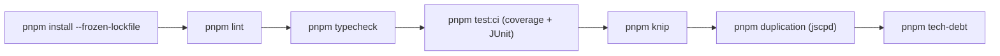

# Development workflow

The branch → code → verify → commit cycle for Flack.

## Day-to-day loop

1. **Start the stack.** `supabase start` (needs Docker), then `pnpm dev`. See [Getting started](../overview/getting-started.md).
2. **Make the change.** Keep functions under the complexity ceiling and files under 600 lines; match the surrounding style. See [Patterns and conventions](patterns-and-conventions.md).
3. **Verify locally.**
   ```bash
   pnpm lint && pnpm typecheck && pnpm test
   ```
   Run `pnpm test:e2e` too when you touch routing or auth/UI flows.
4. **Commit.** The pre-commit hook enforces the gate (see below). Use a co-author trailer for agent-assisted commits.

## Pre-commit hook

Husky runs `precommit` on commit:

```
lint-staged && pnpm typecheck && pnpm tech-debt
```

- `lint-staged` runs Prettier `--check` and ESLint `--max-warnings=0` on staged JS/TS files, and Prettier `--check` on staged JSON/CSS/MD/YAML.
- `pnpm typecheck` runs `tsc --noEmit` across the project.
- `pnpm tech-debt` runs `scripts/scan-tech-debt.mjs`, which fails if any `TODO`/`FIXME`/`HACK`/`XXX` lacks an issue reference.

If the hook rejects formatting, run `pnpm format` to fix it, then re-stage.

## Continuous integration

`.github/workflows/code-quality.yml` runs on pushes to `main` and on every pull request:



The workflow uploads `reports/junit.xml` (per-test timing) and the `coverage/` directory as artifacts. CI uses `pnpm install --frozen-lockfile`, so commit an updated `pnpm-lock.yaml` whenever dependencies change.

## Working with the database

Schema changes never edit an existing migration. Add a new zero-padded file under `supabase/migrations/`, enable RLS with explicit policies, update `src/types/database.ts`, and verify with `supabase db reset` + `pnpm typecheck`. The [supabase-migration skill](tooling.md) walks through this end to end.

## Branching and review

The default branch is `main`. `.github/CODEOWNERS` auto-requests reviewers per path. Security-sensitive areas (auth, Supabase clients, migrations, CI) should get their owner's review before merge.
