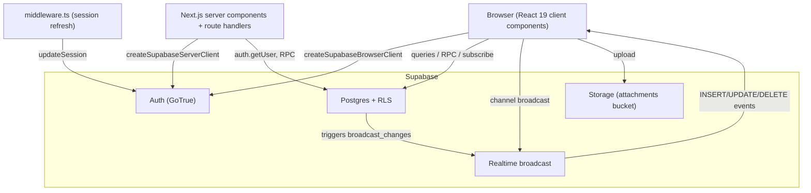
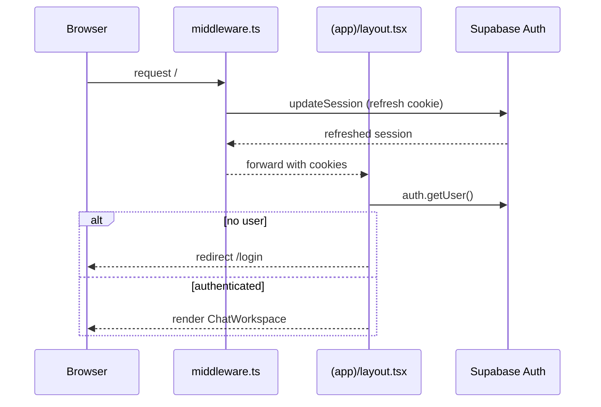

# Architecture

Flack is a two-tier system: a Next.js App Router frontend (server and client components) and Supabase (Postgres, Auth, Realtime, Storage). There is no bespoke API server. The Next.js layer renders UI and guards routes, while all authorization and business rules live in the database as RLS policies and `security definer` functions.

## Components

The browser does most of the data work: the [chat workspace](../features/messaging.md) reads channels and messages, subscribes to a per-channel realtime topic, and writes optimistically. Server components are thin: the [authenticated layout](../features/authentication.md) calls `supabase.auth.getUser()` and redirects unauthenticated visitors, and route handlers under `src/app/auth/callback/route.ts` and `src/app/health/route.ts` run on the Node runtime.

## Request and session flow

`src/middleware.ts` matches almost every route and delegates to `updateSession` in `src/lib/supabase/middleware.ts`, which refreshes the Supabase auth cookie on each request so server components see a valid session. The matcher excludes static assets and images.

## Route groups

Routing uses two App Router route groups under `src/app/`:

- `(app)/` — the authenticated surface. Its `layout.tsx` is the auth guard; `page.tsx` renders the [`ChatWorkspace`](../features/messaging.md).
- `(auth)/` — public pages: `login`, `signup`, and `invite/[token]`.
- `auth/callback/route.ts` — exchanges the magic-link/OAuth code for a session and accepts an invite if a token is present.

See [API and route handlers](../api.md) for the non-page endpoints.

## Data and realtime flow

Writes go straight to Postgres through the Supabase client. Database triggers (`broadcast_message_changes`, `broadcast_reaction_changes`) push row changes onto a `channel:<id>` Realtime topic. The client subscribes to that topic and merges incoming rows into local state with the pure helpers in `src/features/messages/optimistic.ts`. Because the sender also receives its own broadcast (`broadcast: { self: true }`), the optimistic row is reconciled by id rather than duplicated. This is described in detail in [Realtime and optimistic UI](../features/realtime-and-optimistic.md).

## Authorization model

Authorization is enforced in the database, not the app. Every table has RLS enabled and policies written in terms of three helper functions: `current_org_id()`, `is_admin()`, and `is_channel_member()`. Even the Realtime topic is gated — `realtime.messages` has an RLS policy that checks channel membership before a client may subscribe. This means a client cannot read or write data it should not, regardless of frontend bugs. See [Security](../security.md) and [Data models](../reference/data-models.md).

## Technology choices

| Layer          | Choice                                 | Notes                                               |
| -------------- | -------------------------------------- | --------------------------------------------------- |
| Framework      | Next.js 15 App Router, React 19        | RSC enabled; most data work is client-side          |
| Language       | TypeScript strict                      | `allowJs: false`                                    |
| Backend        | Supabase                               | Postgres + Auth + Realtime + Storage                |
| Auth transport | `@supabase/ssr`                        | cookie-based sessions across server/client          |
| Styling        | Tailwind CSS v4 + shadcn/ui (new-york) | tokens in `src/app/globals.css`                     |
| Logging        | `pino`                                 | structured logs with redaction, `src/lib/logger.ts` |

For build, lint, and test tooling see [Tooling](../how-to-contribute/tooling.md).
