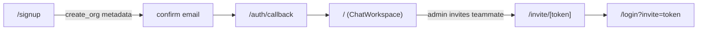

# Getting started

This page covers prerequisites, install, local Supabase setup, environment configuration, and running the app. For the deployment story see [Deployment](../deployment.md).

## Prerequisites

- **Node.js** 20+
- **pnpm** 11.5.0 — pinned in `package.json` via `devEngines`; if you use Corepack, run `corepack enable`
- **Supabase CLI** — for the local Postgres/Auth/Realtime/Storage stack
- **Docker** — required by the Supabase CLI

## 1. Install dependencies

```bash
pnpm install
```

pnpm is required; the project is configured to fail other package managers via `devEngines`.

## 2. Start the local Supabase stack

```bash
supabase start
```

This boots Postgres, Auth, Realtime, Storage, and Studio in Docker, applies every migration in `supabase/migrations/`, and runs `supabase/seed.sql`. Local URLs (from `supabase/config.toml`):

| Service                               | URL                      |
| ------------------------------------- | ------------------------ |
| API                                   | `http://127.0.0.1:54321` |
| Studio                                | `http://127.0.0.1:54323` |
| Inbucket (catches auth/invite emails) | `http://127.0.0.1:54324` |

To reset and re-run all migrations and seed at any time:

```bash
supabase db reset
```

## 3. Configure environment variables

```bash
cp .env.example .env.local
```

Fill in the values printed by `supabase start`:

| Variable                               | Description                                               |
| -------------------------------------- | --------------------------------------------------------- |
| `NEXT_PUBLIC_SUPABASE_URL`             | Supabase API URL (local: `http://127.0.0.1:54321`)        |
| `NEXT_PUBLIC_SUPABASE_PUBLISHABLE_KEY` | publishable / anon key from `supabase start`              |
| `NEXT_PUBLIC_SITE_URL`                 | app base URL for auth redirects (`http://localhost:3000`) |
| `LOG_LEVEL`                            | optional pino log level (defaults to `debug` in dev)      |

`NEXT_PUBLIC_SUPABASE_ANON_KEY` is accepted as a fallback for the publishable key. All Supabase keys used client-side must be public publishable/anon keys, never a service-role key. See [Configuration](../reference/configuration.md).

## 4. Run the dev server

```bash
pnpm dev
```

Open `http://localhost:3000`. Visit `/signup` to create the first organization (you become admin and get `#general` + `#random`), or `/login` to sign in. Invite links land on `/invite/[token]`.

## First-run flow



## Verifying your setup

Run the full local gate before committing:

```bash
pnpm lint && pnpm typecheck && pnpm test
```

For the end-to-end smoke tests (which boot the dev server with dummy Supabase env vars, so no backend is needed):

```bash
pnpm exec playwright install chromium   # first time only
pnpm test:e2e
```

More detail on the test suites is in [Testing](../how-to-contribute/testing.md), and common failure modes are in [Debugging](../how-to-contribute/debugging.md).
