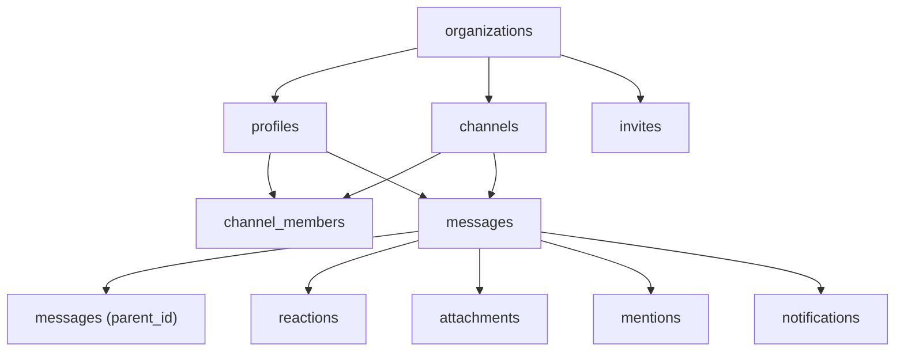

# Data models

The Postgres schema, defined in `supabase/migrations/` and mirrored in `src/types/database.ts`. Every table has RLS enabled and is scoped per organization. For the authorization rules see [Security](../security.md); for the migration workflow see the [supabase-migration skill](../how-to-contribute/tooling.md).

## Entity relationships

## Tables

| Table             | Key columns                                                                              | Purpose                                                                         |
| ----------------- | ---------------------------------------------------------------------------------------- | ------------------------------------------------------------------------------- |
| `organizations`   | `id`, `name`                                                                             | The tenant.                                                                     |
| `profiles`        | `id` (= `auth.users.id`), `org_id`, `email` (citext), `role`                             | Per-org user; `role` is `admin`/`member`.                                       |
| `channels`        | `id`, `org_id`, `type`, `name`, `topic`, `created_by`                                    | `type` is `public`/`private`/`dm`; unique `(org_id, type, name)`.               |
| `channel_members` | `(channel_id, user_id)`, `role`, `last_read_at`                                          | Membership + read state; `role` is `owner`/`member`.                            |
| `messages`        | `id`, `channel_id`, `author_id`, `body`, `parent_id`, `edited_at`, `deleted_at`, `tsv`   | Body capped at 8000 chars; `parent_id` for threads; `tsv` generated for search. |
| `reactions`       | `(message_id, user_id, emoji)`                                                           | Emoji token reactions.                                                          |
| `attachments`     | `id`, `message_id`, `storage_path` (unique), `file_name`, `mime`, `size`                 | File metadata; bytes live in Storage.                                           |
| `mentions`        | `(message_id, mentioned_user_id)`                                                        | Drives mention notifications.                                                   |
| `notifications`   | `id`, `user_id`, `type`, `message_id`, `read_at`                                         | `type` is `mention`/`thread`/`dm`/`reaction`.                                   |
| `invites`         | `id`, `org_id`, `email`, `role`, `token_hash`, `expires_at`, `accepted_at`, `revoked_at` | Hashed-token invites with 7-day expiry.                                         |

### Enums

`profile_role` (`admin`, `member`), `channel_type` (`public`, `private`, `dm`), `member_role` (`owner`, `member`), `notification_type` (`mention`, `thread`, `dm`, `reaction`).

### Indexes

`messages_channel_created_idx`, `messages_parent_idx`, `messages_tsv_idx` (GIN), `channel_members_user_idx`, `notifications_user_idx`, and the partial unique `invites_active_email_idx`.

## Functions

| Function                                                       | Kind                      | Purpose                                                                             |
| -------------------------------------------------------------- | ------------------------- | ----------------------------------------------------------------------------------- |
| `current_org_id()`                                             | helper (security definer) | Caller's `org_id` from `profiles`.                                                  |
| `is_admin()` / `current_role()`                                | helper                    | Admin check / caller role.                                                          |
| `is_channel_member(channel_id [, user_id])`                    | helper                    | Channel membership check.                                                           |
| `create_invite(email, role)`                                   | RPC                       | Admin-only; returns a one-time raw token (stored hashed).                           |
| `accept_invite(token)`                                         | RPC                       | Validates token/expiry/email and joins the caller to the org.                       |
| `search_messages(query, limit)`                                | RPC                       | Full-text, membership-filtered, ranked search. See [Search](../features/search.md). |
| `add_member_to_public_channels(org, user)`                     | helper                    | Bulk-join public channels.                                                          |
| `create_default_channels(org, user)`                           | helper                    | Provisions `#general` + `#random`.                                                  |
| `handle_new_user()`                                            | trigger fn                | Provisions profile/org/channels on auth signup (invite vs create-org paths).        |
| `broadcast_message_changes()` / `broadcast_reaction_changes()` | trigger fn                | Push row changes to the `channel:<id>` Realtime topic.                              |
| `create_mention_notifications()`                               | trigger fn                | Insert notifications for mentioned users.                                           |

## Triggers

| Trigger                       | Table        | Fires                                  |
| ----------------------------- | ------------ | -------------------------------------- |
| `on_auth_user_created`        | `auth.users` | after insert → `handle_new_user`       |
| `messages_broadcast_changes`  | `messages`   | after insert/update/delete → broadcast |
| `reactions_broadcast_changes` | `reactions`  | after insert/update/delete → broadcast |
| `mentions_notify`             | `mentions`   | after insert → create notifications    |

## TypeScript mirror

`src/types/database.ts` exports the `Database` type that parameterizes every Supabase client, with `Tables`, `Functions`, and `Enums`. UI-facing shapes (`Channel`, `ChatMessage`, `Profile`, `Reaction`, `Attachment`, `SearchHit`) live in `src/types/chat.ts`. Keeping these in sync with migrations is a hard rule — an out-of-date type is a type-safety hole.
