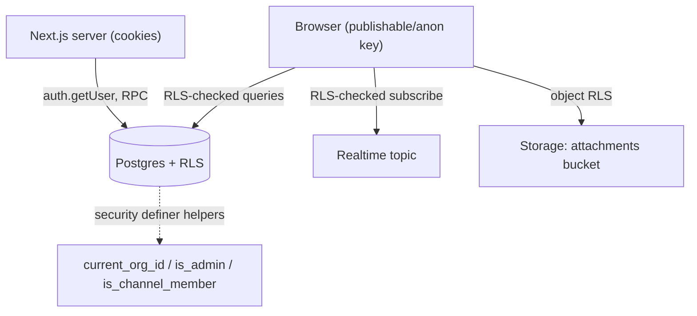

# Security

Flack's security model is database-first: authorization is enforced by Postgres row-level security (RLS), not by application code. Even if the frontend has a bug, a client cannot read or write rows it is not entitled to.

## Trust boundaries

The browser only ever holds a public publishable/anon key. There is no service-role key in the client, and `.env`/`.env.local` are gitignored (only `.env.example` is tracked). All privileged operations run as `security definer` functions in the database.

## Row-level security

Every table in `public` has RLS enabled, with policies written against three helpers (defined `security definer`):

- `current_org_id()` — the caller's organization, read from `profiles`.
- `is_admin()` — whether the caller is an org admin.
- `is_channel_member(channel_id [, user_id])` — channel membership.

Representative policies (from `supabase/migrations/001_initial_schema.sql` and `002_multi_tenant_organizations.sql`):

| Table                                    | Read                            | Write                                                                       |
| ---------------------------------------- | ------------------------------- | --------------------------------------------------------------------------- |
| `profiles`                               | visible within the same org     | a user updates only their own row, and cannot change `org_id`/`role`        |
| `channels`                               | same org and (public or member) | insert requires `created_by = auth.uid()`; updates limited to owners/admins |
| `messages`                               | channel members only            | authors insert/edit/delete only their own, in channels they belong to       |
| `reactions` / `attachments` / `mentions` | channel members                 | scoped to `auth.uid()` ownership + membership                               |
| `invites`                                | org admins                      | admins only                                                                 |

Multi-tenancy is the key invariant: migration `002` adds org scoping to channel and invite policies and tightens the profile-update policy so a user cannot escalate their role or move orgs.

## Realtime and storage are gated too

- **Realtime:** `realtime.messages` has an RLS policy that parses the topic string (`channel:<uuid>`) and checks `is_channel_member` before allowing a subscription. You cannot listen to a channel you are not in.
- **Storage:** the `attachments` bucket is private. Object policies derive the channel id from the first path segment (`storage.foldername(name)[1]`) and require membership for read/write.

## Invite security

Invites never store the raw token. `create_invite` generates 32 random bytes, returns the raw hex token once, and stores only a SHA-256 `token_hash` with a 7-day expiry. `accept_invite` re-hashes the presented token, checks it is unexpired and unrevoked, and verifies the invite email matches the signed-in user's email before joining them to the org. Admin-only creation is enforced inside the function (it raises if the caller is not an admin), independent of any UI check.

## Secrets and logging

Server-side logs run through the `pino` logger, which redacts `password`, `token`, `email`, `authorization`, `cookie`, and related fields as `[redacted]` (see [Observability](systems/observability.md)). This keeps tokens and PII out of logs even when whole objects are logged.

## Repository controls

`.github/CODEOWNERS` routes review of security-sensitive paths (auth, Supabase clients, migrations, CI) to their owners. The pre-commit hook and CI gate (lint, typecheck, tests, knip, jscpd, tech-debt) reduce the chance of regressions reaching `main`. See [Development workflow](how-to-contribute/development-workflow.md).

## Where to change things

Authorization changes belong in a new migration (never edit an applied one), enabling RLS and writing policies with the helper functions. Follow the [supabase-migration skill](how-to-contribute/tooling.md), and keep `src/types/database.ts` in sync.
