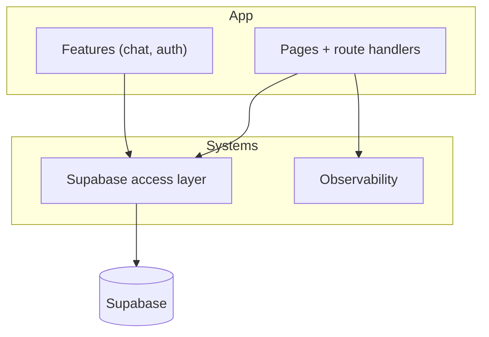

# Systems

Internal building blocks that don't map to a single user-facing feature. These are the cross-cutting layers the [features](../features/index.md) sit on top of.

## Systems map

| System                                            | Path                                                                | Responsibility                                                     |
| ------------------------------------------------- | ------------------------------------------------------------------- | ------------------------------------------------------------------ |
| [Supabase access layer](supabase-access-layer.md) | `src/lib/supabase/`                                                 | Browser/server/middleware clients, env resolution, session refresh |
| [Observability](observability.md)                 | `src/lib/logger.ts`, `src/lib/health.ts`, `src/app/health/route.ts` | Structured logging with redaction and the readiness endpoint       |

## How they fit

The Supabase access layer is the single doorway to the backend: every feature and route handler obtains a typed client through it, and never reads Supabase env vars directly. Observability provides the logger used by server-side code and the `/health` probe used by deploy and uptime checks.

The data tier these systems talk to (tables, RLS, functions, triggers) is documented under [Data models](../reference/data-models.md) and [Security](../security.md).
