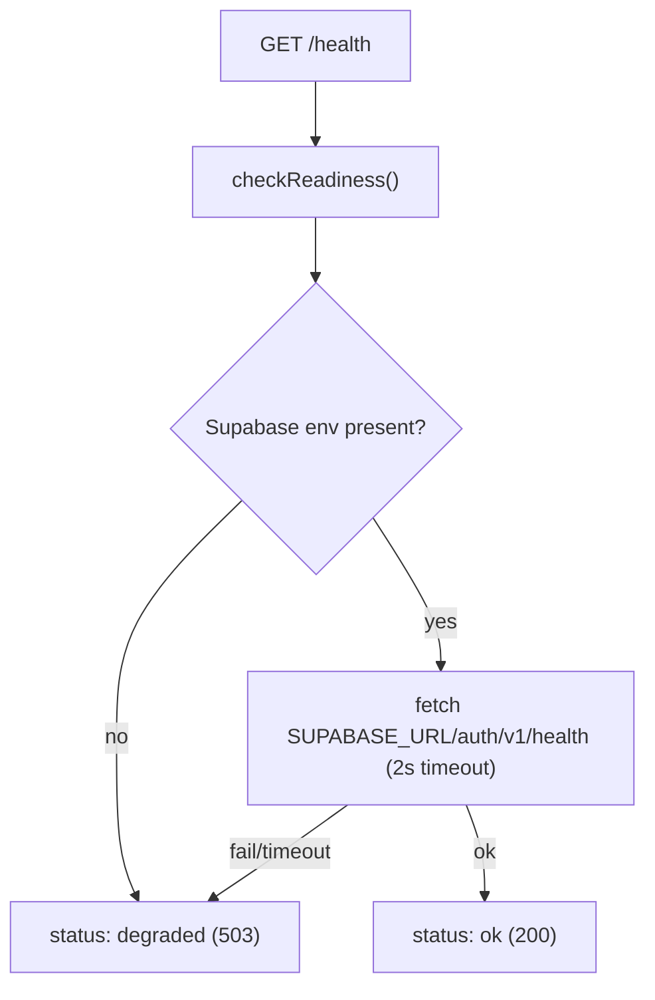

# Observability

Active contributors: factory-sam

## Purpose

The observability system gives server-side code a structured, redaction-aware logger and exposes a readiness endpoint for load balancers, uptime monitors, and deploy smoke checks. Both are deliberately small and dependency-light.

## Directory layout

```
src/lib/logger.ts        # pino logger + requestLogger(scope, context)
src/lib/health.ts        # checkReadiness(): env + Supabase connectivity probe
src/app/health/route.ts  # GET /health route handler
```

## Key abstractions

| Symbol           | File                      | Role                                                             |
| ---------------- | ------------------------- | ---------------------------------------------------------------- |
| `logger`         | `src/lib/logger.ts`       | Base pino logger (JSON, ISO timestamps, `service: "flack"`)      |
| `requestLogger`  | `src/lib/logger.ts`       | Child logger tagged with a `scope` and request context           |
| `checkReadiness` | `src/lib/health.ts`       | Dependency-injectable readiness check returning a `HealthReport` |
| `GET` (health)   | `src/app/health/route.ts` | Serializes the report; `200` ok / `503` degraded, `no-store`     |

## Structured logging

`logger` is a `pino` instance configured with:

- JSON output, ISO timestamps, and a `service: "flack"` base field.
- Level from `LOG_LEVEL`, defaulting to `debug` in development and `info` in production.
- **Redaction** of sensitive paths (`password`, `token`, `invite_token`, `access_token`/`refresh_token`, `email`, `authorization`, `cookie`, plus wildcard and `req.headers.*` variants), censored as `[redacted]`.

Use `requestLogger(scope, context)` to get a child logger that stamps every line with a scope. For example, the auth callback logs under `scope: "auth.callback"` and the health route under `scope: "health"`. Logging is server-only: `pino` targets the Node.js runtime, so the logger must not be imported into Edge-runtime middleware. Log conventions: `warn` for recoverable failures, `error` (with `{ err }`) for unexpected ones, `info` for notable lifecycle events.

## Health checks



`checkReadiness` (in `src/lib/health.ts`) verifies the Supabase env is present and probes `${SUPABASE_URL}/auth/v1/health` with an `AbortController` timeout (2s). It returns a `HealthReport` (`status`, `uptimeSeconds`, `timestamp`, `checks[]`). The route returns `200` when ready and `503`/`status: "degraded"` when a check fails, and logs a warning on degradation. The function takes injectable `fetch`, `now`, and `uptimeSeconds`, which is how `src/lib/health.test.ts` covers the healthy, missing-env, non-ok, and network-error paths.

## Integration points

- **Logger used by:** `src/app/auth/callback/route.ts`, `src/lib/supabase/server.ts`, and `src/app/health/route.ts`.
- **Health consumed by:** external uptime monitors and deploy checks; see [How to monitor](../how-to-monitor.md) and [Deployment](../deployment.md).
- **Tests:** `src/lib/logger.test.ts`, `src/lib/health.test.ts`, and the `e2e/health.spec.ts` smoke test.

## Entry points for modification

To add a new sensitive field, extend the `redactPaths` array in `src/lib/logger.ts`. To add a downstream dependency to the readiness check (for example a storage probe), push another entry onto the `checks` array in `checkReadiness`. To change the readiness response contract, update both `src/lib/health.ts` and the route handler together.
