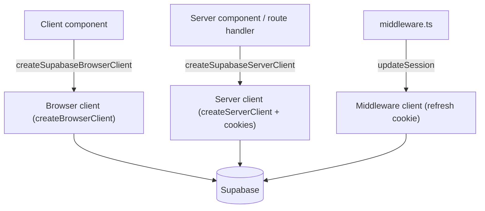

# Supabase access layer

Active contributors: factory-sam

## Purpose

Every interaction with Supabase goes through `src/lib/supabase/`. This layer provides three client factories for the three runtime contexts (browser, server, middleware), a single env resolver, and the session-refresh helper. Centralizing this keeps env access in one place and makes every client strongly typed with the `Database` schema.

## Directory layout

```
src/lib/supabase/
  env.ts          # getSupabaseEnv(): resolves URL + publishable key, or null
  client.ts       # createSupabaseBrowserClient() for client components
  server.ts       # createSupabaseServerClient() for server components / route handlers
  middleware.ts   # updateSession(request): refreshes the auth cookie
```

## Key abstractions

| Symbol                        | File                             | Role                                                                                     |
| ----------------------------- | -------------------------------- | ---------------------------------------------------------------------------------------- |
| `getSupabaseEnv`              | `src/lib/supabase/env.ts`        | Reads `NEXT_PUBLIC_SUPABASE_URL` and the publishable/anon key; returns `null` if missing |
| `createSupabaseBrowserClient` | `src/lib/supabase/client.ts`     | Memoized browser client with realtime tuning (`eventsPerSecond: 10`)                     |
| `createSupabaseServerClient`  | `src/lib/supabase/server.ts`     | Cookie-backed server client; logs and throws on missing env                              |
| `updateSession`               | `src/lib/supabase/middleware.ts` | Recreates the response with refreshed cookies after `auth.getUser()`                     |

## How it works

### Env resolution

`getSupabaseEnv()` is the only place that reads Supabase env vars. It accepts `NEXT_PUBLIC_SUPABASE_PUBLISHABLE_KEY` or falls back to `NEXT_PUBLIC_SUPABASE_ANON_KEY`, and returns `null` when either value is absent. Callers decide how to react: the server client logs an error and throws; `updateSession` quietly passes the request through unmodified (so the public site still renders without a backend, which is what the e2e smoke tests rely on).

### Client contexts



- **Browser** (`client.ts`): created once and memoized in a module-level singleton, with realtime params capped at 10 events/second.
- **Server** (`server.ts`): wraps Next's `cookies()` for read and best-effort write (server components can't set cookies, so the write is wrapped in a `try/catch`). Used by `(app)/layout.tsx`, the invite page, and the auth callback.
- **Middleware** (`middleware.ts`): the trickiest piece. It builds a response, lets Supabase write refreshed cookies onto both the request and a rebuilt response, then calls `auth.getUser()` to trigger the refresh. The rebuilt-response pattern is required by `@supabase/ssr` to propagate cookies correctly.

### Session refresh entry point

`src/middleware.ts` is a thin wrapper that calls `updateSession` and exports the `config.matcher`, which excludes `_next` assets and common image extensions so refresh only runs on real navigations.

## Integration points

- **Used by:** [Authentication](../features/authentication.md) (guard, callback, forms) and [Messaging](../features/messaging.md) (all reads/writes/realtime).
- **Typed with:** `Database` from `src/types/database.ts`, so query results and RPC args are checked at compile time. See [Data models](../reference/data-models.md).
- **Logging:** the server client logs missing-env errors through `src/lib/logger.ts`. See [Observability](observability.md).

## Entry points for modification

To add configuration (custom headers, auth options, realtime tuning), edit the relevant factory. To change which routes refresh the session, edit the matcher in `src/middleware.ts`. Always route new env reads through `getSupabaseEnv()` rather than touching `process.env` directly — this is an enforced convention (see [Patterns and conventions](../how-to-contribute/patterns-and-conventions.md)).
